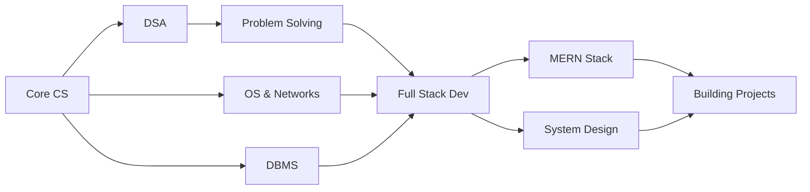

<div align="center">

# Hi there, I'm Nayan 👋

### 🎓 Engineering Student | 💻 Aspiring Software Developer
### 🚀 Building Tomorrow's Solutions Today

[](https://github.com/Nayan6901)
[](https://github.com/Nayan6901)


</div>

---

## 🧑‍💻 About Me

```javascript
const nayan = {
    location: "India",
    education: "Engineering Student",
    focus: ["Data Structures", "Algorithms", "Full-Stack Development"],
    currentlyLearning: ["MERN Stack", "System Design", "DSA"],
    philosophy: "Consistency > Motivation",
    goal: "Building impactful software solutions",
    funFact: "I debug with console.log() and I'm not ashamed! 😄"
};
```

- 🔭 Currently working on **Full-Stack MERN Projects**
- 🌱 Learning **Advanced DSA** and **System Design**
- 💡 Passionate about **Clean Code** and **Problem Solving**
- 🎯 2024 Goal: **Contribute to Open Source** & **Land a Software Engineering Role**
- ⚡ Fun fact: **I believe the best code is the code you don't have to write!**

---

## 🛠️ Tech Stack

<div align="center">

### Languages


### Frontend


### Backend


### Tools & Technologies


</div>

---

## 🚀 Featured Projects

<div align="center">

<table>
<tr>
<td width="50%">

### 📋 TaskForge
**Full-Stack Task & Project Manager**

Built with MERN Stack (MongoDB, Express, React, Node.js)

`React` `Node.js` `MongoDB` `Express` `REST API`

[View Project →](https://github.com/Nayan6901)

</td>
<td width="50%">

### ⏰ ESP32 Internet Clock
**NTP-Based Real-Time Clock**

IoT project with LCD display and WiFi connectivity

`ESP32` `C++` `NTP` `Arduino` `IoT`

[View Project →](https://github.com/Nayan6901)

</td>
</tr>
<tr>
<td width="50%">

### 🕐 Digital Clock
**Arduino-Based RTC Project**

Precision timekeeping with DS3231 RTC module

`Arduino Nano` `DS3231` `RTC` `Hardware`

[View Project →](https://github.com/Nayan6901)

</td>
<td width="50%">

### 💡 More Coming Soon...
**Building in Public**

Check out my repositories for more projects!

`Open Source` `Learning` `Building`

[Explore Repos →](https://github.com/Nayan6901?tab=repositories)

</td>
</tr>
</table>

</div>

---

## 📊 GitHub Statistics

<div align="center">
  


</div>

---

## 🧠 Learning Journey

<div align="center">



</div>

### 📚 Current Focus Areas

- ✅ **Data Structures & Algorithms** - Daily problem solving on LeetCode/GeeksforGeeks
- ✅ **Computer Science Fundamentals** - OS, Networks, DBMS deep dive
- ✅ **MERN Stack Development** - Building production-ready applications
- ✅ **System Design** - Learning scalable architecture patterns
- ✅ **Clean Code Practices** - Writing maintainable, readable code

---

## 🎯 2024 Goals

- [ ] 🏆 Solve 500+ DSA problems
- [ ] 🚀 Build 5+ Full-Stack projects
- [ ] 📝 Write technical blogs
- [ ] 🤝 Contribute to Open Source
- [ ] 💼 Land a Software Engineering role
- [ ] 🎓 Master System Design fundamentals

---

## 📫 Let's Connect!

<div align="center">

[](https://github.com/Nayan6901)
[](https://linkedin.com/in/nayan)
[](https://twitter.com/nayan)
[](mailto:nayan@example.com)

</div>

---

<div align="center">

### 💭 Quote of the Day


---

### ⭐ Always Learning. Always Improving. Always Building.


**Thanks for visiting! Feel free to explore my repositories and reach out for collaborations! 🚀**

</div>

---

<div align="center">

**Made with ❤️ by Nayan**

*"Code is like humor. When you have to explain it, it's bad." – Cory House*

</div>
