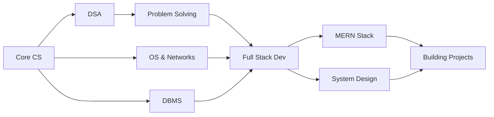

<div align="center">


### 🎓 Engineering Student &nbsp;|&nbsp; 💻 Full Stack Developer &nbsp;|&nbsp; 🚀 Builder

[](https://github.com/Nayan6901)
[](https://github.com/Nayan6901)
[](https://github.com/Nayan6901)


</div>

---

## 🧑‍💻 About Me

```javascript
const nayan = {
    location: "India",
    education: "Engineering Student",
    focus: ["Data Structures", "Algorithms", "Full-Stack Development"],
    currentlyLearning: ["MERN Stack", "System Design", "DSA"],
    philosophy: "Consistency > Motivation",
    goal: "Building impactful software solutions",
    funFact: "I debug with console.log() and I'm not ashamed! 😄"
};
```

- 🔭 Currently working on **Full-Stack MERN Projects**
- 🌱 Learning **Advanced DSA** and **System Design**
- 💡 Passionate about **Clean Code** and **Problem Solving**
- 🎯 Goal: **Contribute to Open Source** & **Land a Software Engineering Role**
- ⚡ Fun fact: **The best code is the code you don't have to write!**

---

## 🛠️ Tech Stack

<div align="center">

**Languages**


**Frontend**


**Backend**


**Tools**


</div>

---

## 🚀 Featured Projects

<div align="center">

<table>
<tr>
<td width="50%" valign="top">

### 📸 LensifyMe
**Photography Portfolio Platform**

Book sessions, manage galleries & connect with clients — built end-to-end with MERN.

`React` `Node.js` `MongoDB` `Express` `TailwindCSS` `JWT`

[View Project →](https://github.com/Nayan6901)

</td>
<td width="50%" valign="top">

### 🗂️ ProjectFlow — Jira Clone
**Team Project Management Tool**

Sprints, drag-and-drop Kanban boards & role-based access control (Admin / Member).

`React` `Redux` `Node.js` `MongoDB` `Express`

[View Project →](https://github.com/Nayan6901)

</td>
</tr>
<tr>
<td width="50%" valign="top">

### 📋 TaskForge
**Full-Stack Task Manager**

Organize tasks by project, priority & deadline with full CRUD and user auth.

`React` `Node.js` `MongoDB` `Express` `REST API`

[View Project →](https://github.com/Nayan6901)

</td>
<td width="50%" valign="top">

### 💡 More Coming Soon...
**Building in Public**

Check out my repositories for more projects!

`Open Source` `Learning` `Building`

[Explore Repos →](https://github.com/Nayan6901?tab=repositories)

</td>
</tr>
</table>

</div>

---

## 📊 GitHub Statistics

<div align="center">


</div>

---

## 🧠 Learning Journey

<div align="center">



</div>

### 📚 Current Focus Areas

- ✅ **Data Structures & Algorithms** — Daily problem solving on LeetCode / GeeksforGeeks
- ✅ **Computer Science Fundamentals** — OS, Networks, DBMS deep dive
- ✅ **MERN Stack Development** — Building production-ready applications
- ✅ **System Design** — Learning scalable architecture patterns
- ✅ **Clean Code Practices** — Writing maintainable, readable code

---

## 🎯 Goals

- [ ] 🏆 Solve 500+ DSA problems
- [ ] 🚀 Build 5+ Full-Stack projects
- [ ] 📝 Write technical blogs
- [ ] 🤝 Contribute to Open Source
- [ ] 💼 Land a Software Engineering role
- [ ] 🎓 Master System Design fundamentals

---

## 📫 Let's Connect!

<div align="center">

[](https://github.com/Nayan6901)
[](https://linkedin.com/in/nayan)
[](https://twitter.com/nayan)
[](mailto:nayan@example.com)

</div>

---

<div align="center">

### 💭 Quote of the Day


---

### ⭐ Always Learning. Always Improving. Always Building.

**Thanks for visiting! Feel free to explore my repositories and reach out for collaborations! 🚀**

*"Code is like humor. When you have to explain it, it's bad." — Cory House*

</div>


